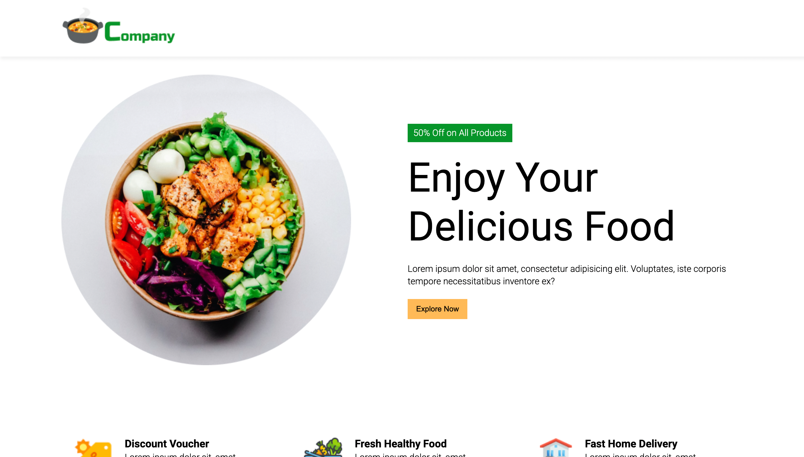
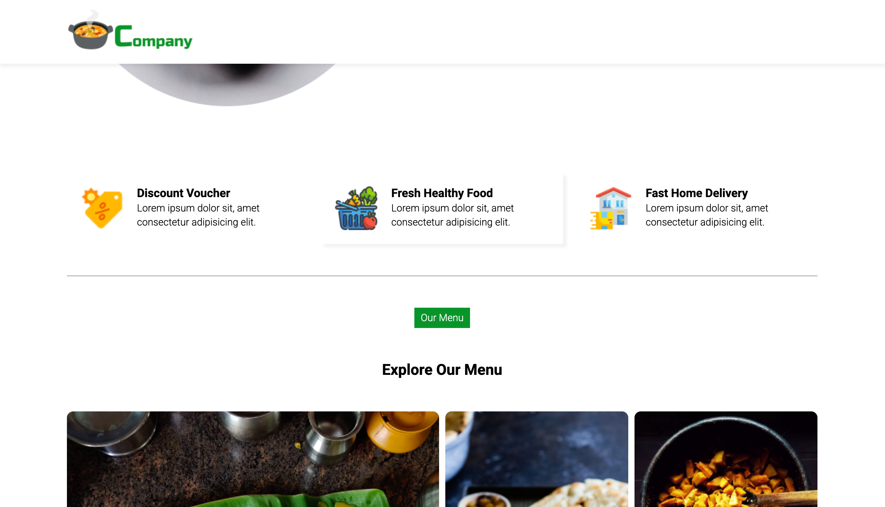
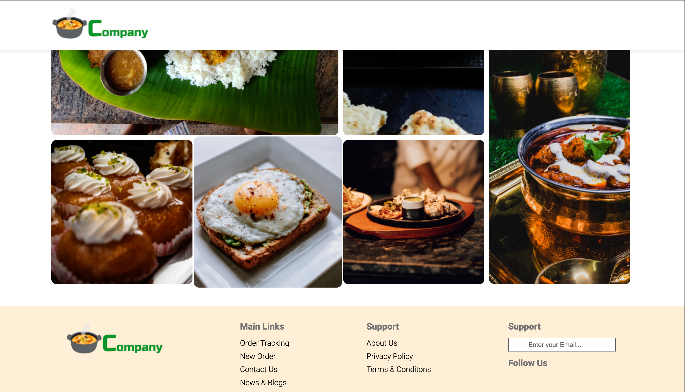

# 🍽️ Restaurant Website

A modern, responsive restaurant website built with HTML, CSS . This project showcases a sleek UI with sections like Hero, Menu, About, Gallery, and Contact.

<!-- > 🚀 Live Preview: [View Website](https://sanjoy-ui.github.io/Restaurant-website) -->

---

## 🖼️ Features

- 🔥 Clean and aesthetic UI
- 📱 Fully responsive 
- 📜 Smooth scrolling navigation
- 🧭 Sticky header
- 📸 Image gallery section
- 📧 Contact form design (non-functional)

---

## 🛠️ Tech Stack

- **HTML5**
- **CSS3**

---

## 📂 Folder Structure

```
Restaurant-website/
├── assets/
│ ├── css/
│ ├── js/
│ └── images/
├── index.html
└── README.md
```

---

---

## 📸 Screenshots

 <!-- optional -->
 <!-- optional -->
 <!-- optional -->


---

## 🧑‍💻 Author

**Sanjoy Deb**  
📧 [sanjoydeb404@gmail.com](mailto:sanjoydeb404@gmail.com)  
🔗 [LinkedIn](https://www.linkedin.com/in/sanjoy-deb-637028328) | [GitHub](https://github.com/Sanjoy-ui)

---


